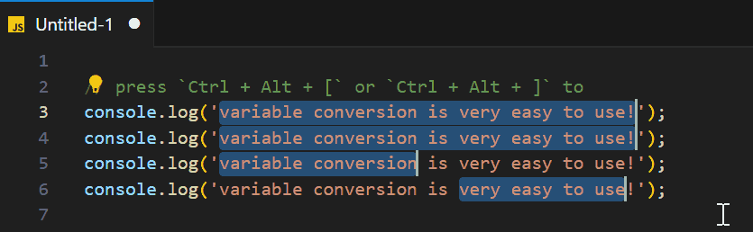
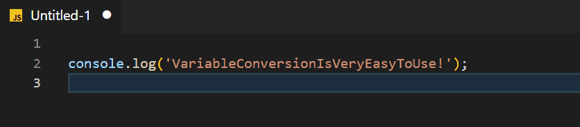
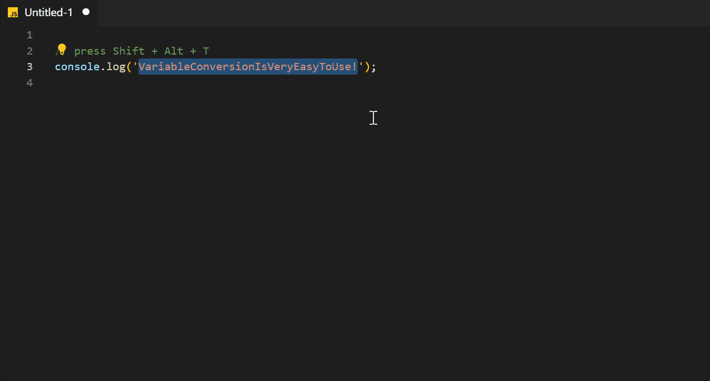
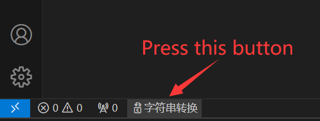
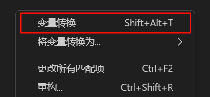
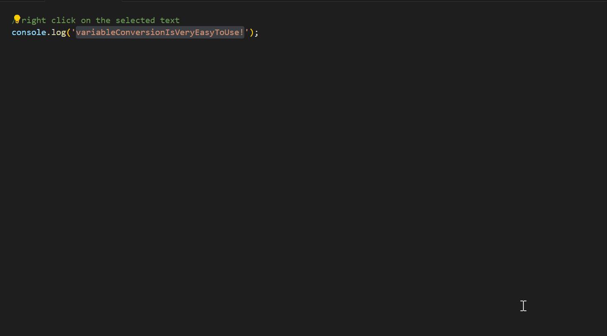
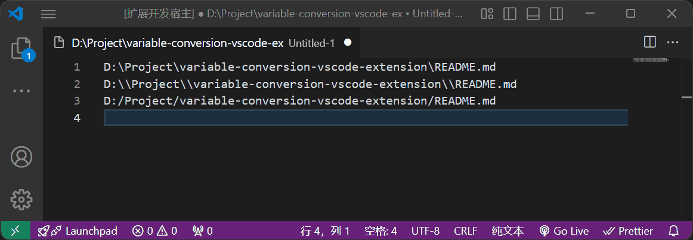
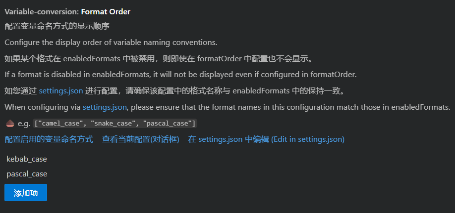
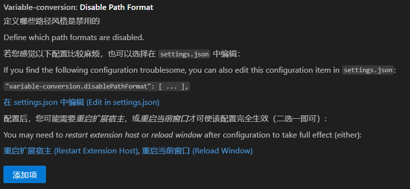

# 变量命名转换助手 — Variable Conversion (VSCode 扩展)

[Marketplace](https://marketplace.visualstudio.com/items?itemName=coder-xiaomo.variable-conversion) [GitHub](https://github.com/coder-xiaomo/variable-conversion-vscode-extension.git) [Gitee](https://gitee.com/coder-xiaomo/variable-conversion-vscode-extension.git)

一个强大的变量命名及路径风格转换插件，支持一键转换、循环转换，支持右键菜单、快捷键、状态栏等多种方式使用。 
A powerful variable and path conversion extension. Supports one-key conversion & cyclic conversion. You can use it through the editor menu, shortcut keys and status bar.

> **【近期更新】**
>
> **v2.2.0 (2025-12-05)**
>
> - 支持配置目标转换格式顺序
> - 支持展示当前配置的格式顺序信息弹窗，可显示配置重复项和无效项
> - 支持从弹窗中点击按钮快捷跳转至设置页对应配置项
>
> **v2.1.0 (2025-07-14)**
>
> - 支持仅开启部分目标转换格式 (优化 VSCode 配置项)
>
> **v2.0.0 (2024-12-15)**
>
> - 支持 Windows / Unix 路径风格转换（可选中文本中的路径，然后使用  `Ctrl + Alt + /` 快捷键，或点击右键菜单、底部状态栏路径转换按钮轻松实现转换）

- ✅ 支持多选区 Support multi-selection
- ✅ 支持多窗口 Support subwindow
- ✅ 支持撤回 & 重做 Support undo & redo (Ctrl + Z / Ctrl + Y)
- ✅ 支持仅开启部分目标转换格式 Support enabling only partial target conversion formats

> 🔭 Tips for Chinese users: 如果您无法看到下文图片，请[点这里](https://gitee.com/coder-xiaomo/variable-conversion-vscode-extension/blob/main/README.md)查看

## 如何使用？ How to Use?

### 循环转换 Cyclic conversion

选中需要转换的内容，然后按下 `Ctrl + Alt + [` 或 `Ctrl + Alt + ]` 即可前后灵活切换变量命名方式。  
Select what you want to convert in the editor, and then press `Ctrl + Alt + [` or `Ctrl + Alt + ]` to flexibly convert variable name flexibly.

### 基础转换 Basic conversion

**1. 选中代码中需要转换的内容** **Select The Text To Convert**

**2. 按 `Shift + Alt + T`** **Press `Shift + Alt + T`**

或者点击状态栏的 `变量转换` 按钮 
Or click the `String Conversion` button in the status bar

或者右键 -> `变量转换` 
Or right-click -> `String Conversion`

或者右键 -> 将变量转换为...  
Or right-click on the selected text -> Convert string to...

**3. 选择转换目标，转换完成** **Select the conversion target and complete**

### 路径转换 Path Conversion (Beta)

> 该功能仍在 Beta 测试阶段，如您在使用过程中遇到问题，欢迎通过文末联系方式进行反馈。
>
> This feature is still in Beta testing stage, if you encounter any problems during use, please give feedback via the contact information at the end of the article.

路径转换与变量转换操作逻辑基本相同，都可以通过 *右键菜单*、*底部状态栏*、*快捷键* 等方式使用，唯一区别是快捷键的不同。

路径转换快捷键为：

- 切换下一个路径风格：`Ctrl + Alt + /`
-  切换上一个路径风格：`Ctrl + Alt + Shift + /`

**注：** 目前 `v2.0.0` 版本暂仅支持 `Windows 风格路径` 与 `Unix 风格路径` 互转，所以这两个快捷键目前效果相同。**后续会陆续增加其他更多路径风格**（例如 `Windows Git Bash` 风格，浏览器 `file://` 协议风格等），敬请期待。

## 快捷键 Shortcut key

| 功能 Feature                                                 | 快捷键 shortcut key    |
| ------------------------------------------------------------ | ---------------------- |
| 变量转换 快速选择 Variable Conversion QuickPick              | Shift + Alt + T        |
| 变量循环转换→上一个 Variable Cyclic Conversion → Previous one | Ctrl + Alt + [         |
| 变量循环转换→下一个 Variable Cyclic Conversion → Next one    | Ctrl + Alt + ]         |
| 显示格式顺序信息弹窗 Show Format Order Info Dialog           | Ctrl + Alt + \`        |
| 路径转换 快速选择 Path Conversion QuickPick                  | Shift + Alt + /        |
| 路径循环转换→上一个 Path Cyclic conversion → Previous one    | Ctrl + Alt + /         |
| 路径循环转换→下一个 Path Cyclic conversion → Next one        | Ctrl + Shift + Alt + / |

> 若您觉得快捷键使用不顺手，您可在 VSCode 左下角齿轮图标⚙ → 键盘快捷方式中自定义修改快捷键。

## 配置项 Configurations

| 配置项 Configuration Key                | 描述 Description                                             | 配置示例                                        | 默认值   |
| --------------------------------------- | ------------------------------------------------------------ | ----------------------------------------------- | -------- |
| `variable-conversion.enabledFormats`    | 配置启用的变量命名方式 Configuration of Enabled Variable Naming Conventions. | `{ "xxxCase.enabled": boolean, ... }`           | 见配置项 |
| `variable-conversion.formatOrder`       | 配置变量命名方式的显示顺序 Configure the display order of variable naming conventions. | `[ "camel_case", "pascal_case", "snake_case" ]` | 见配置项 |
| `variable-conversion.disablePathFormat` | 定义哪些路径风格是禁用的 Define which path formats are disabled. | `["windows_style", "unix_style"]`               | 见配置项 |

配置项如下：

<!--
GitHub 上这种表格高亮行会有问题（表头不会高亮）

|         |  |
| :----------------------------------------------------------: | :----------------------------------------------: |
|                   **Enabled Formats 配置**                   |              **Format Order 配置**               |
|  |                                                  |
|                 **Disable Path Format 配置**                 |                                                  |
 -->

<table>
  <tr>
    <td align="center"><strong>Enabled Formats 配置</strong></td>
    <td align="center"><strong>Format Order 配置</strong></td>
  </tr>
  <tr>
    <td align="center"></td>
    <td align="center"></td>
  </tr>
  <tr>
    <td align="center"><strong>Disable Path Format 配置</strong></td>
    <td align="center"></td>
  </tr>
  <tr>
    <td align="center"></td>
    <td align="center"></td>
  </tr>
</table>

## 支持的类型 Support Case

### 变量转换

| 类型                                       | Case                     | 举例 e.g.        |
| ------------------------------------------ | ------------------------ | ---------------- |
| 小驼峰(驼峰)命名                           | Camel Case               | fooBar           |
| 大驼峰(帕斯卡)命名                         | Pascal Case              | FooBar           |
| 下划线(蛇形)命名                           | Snake Case               | foo_bar          |
| 下划线(蛇形) + 小驼峰(驼峰)命名            | Snake Camel Case         | foo_Bar          |
| 下划线(蛇形) + 大驼峰(帕斯卡)命名          | Snake Pascal Case        | Foo_Bar          |
| 下划线(蛇形) + 全大写命名                  | Snake Upper Case         | FOO_BAR          |
| 中划线(连字符/脊柱式)命名                  | Kebab Case / Spinal Case | foo-bar          |
| 中划线(连字符/脊柱式) + 小驼峰(驼峰)命名   | Kebab Camel Case         | foo-Bar          |
| 中划线(连字符/脊柱式) + 大驼峰(帕斯卡)命名 | Kebab Pascal Case        | Foo-Bar          |
| 中划线(连字符/脊柱式) + 全大写命名         | Kebab Upper Case         | FOO-BAR          |
| 空格分隔命名                               | Space Case               | foo bar          |
| 空格分隔 + 小驼峰(驼峰)命名                | Space Camel Case         | foo Bar          |
| 空格分隔 + 大驼峰(帕斯卡)命名              | Space Pascal Case        | Foo Bar          |
| 空格分隔 + 全大写命名                      | Space Upper Case         | FOO BAR          |
| 点分隔命名                                 | Dot Case                 | foo.bar          |
| 点分隔 + 小驼峰(驼峰)命名                  | Dot Camel Case           | foo.Bar          |
| 点分隔 + 大驼峰(帕斯卡)命名                | Dot Pascal Case          | Foo.Bar          |
| 点分隔 + 全大写命名                        | Dot Upper Case           | FOO.BAR          |
| 全小写                                     | Lower Case               | foo_bar / foobar |
| 全大写                                     | Upper Case               | FOO_BAR / FOOBAR |

### 路径转换

现已支持的路径风格：

| 路径风格     | Style         | 举例 e.g.                                      |
| ------------ | ------------- | ---------------------------------------------- |
| Windows 风格 | Windows Style | `C:\Windows\System32`  `.\public\assets\` |
| Unix 风格    | Unix Style    | `/usr/bin` `./public/assets/`             |

尚未支持的路径风格：

| 路径风格                   | Case                              | 举例 e.g.                             |
| -------------------------- | --------------------------------- | ------------------------------------- |
| 👇未来计划支持              |                                   |                                       |
| Windows 风格（反斜杠转义） | Windows Style (Backslash Escaped) | `C:\\Windows\\System32`               |
| Unix 风格（反斜杠转义）    | Unix Style (Backslash Escaped)    | `\/usr\/bin`                          |
| Windows Git Bash 风格      | Windows Git Bash Style            | `/c/Windows/System32`                 |
| 👇未来可能支持              |                                   |                                       |
| 浏览器 `file://` 协议风格  |                                   | `file:///C:/Program%20Files%20(x86)/` |

## 小提示 Tips

#### 关于文本选区... About text selections...

- 可以先按住 `Alt` 键不放，再鼠标先后选中多个选区
  You can first hold down `Alt`, and then use the mouse to select multiple selection
- 可以先按住 `Shift + Alt` 键不放，再按下鼠标左键，使用鼠标滑过需要选中的区块
  You can first hold down `Shift + Alt`, then press the left mouse button, and use the mouse to slide over the block that needs to be selected
- 可以通过 `Ctrl + D` 快捷键选中光标所在的单词
  You can press `Ctrl + D` to select the word near the cursor

## 反馈 Feedback

如果您觉得本插件还不够好用，有更好的使用建议；或者发现了 BUG，欢迎[前往 GitHub 仓库提 issue](https://github.com/coder-xiaomo/variable-conversion-vscode-extension/issues). 使用简体中文、繁體中文或 English 均可，不建议使用翻译软件翻译，否则可能会让文字描述变得抽象难懂。 
If you feel that this extension is not good to use, or you have a better use suggestion, or found a BUG, welcome to [create an issue on GitHub](https://github.com/coder-xiaomo/variable-conversion-vscode-extension/issues). English, 简体中文 or 繁體中文 are all supported, it is not recommended to use translation software, otherwise it may make the text description become abstract and difficult to understand.

## 开源共建 OpenSource & Contribute

本插件已开源(MIT License)，欢迎提 Pr 共建，让插件变得更好用！ 
This plug-in has been open source (MIT License), welcome to Pr co-construction, let the plug-in become better!

GitHub Repo (开源地址): https://github.com/coder-xiaomo/variable-conversion-vscode-extension.git

Gitee Mirror (码云镜像): https://gitee.com/coder-xiaomo/variable-conversion-vscode-extension.git

-----

**玩得开心！**

**Enjoy!**
